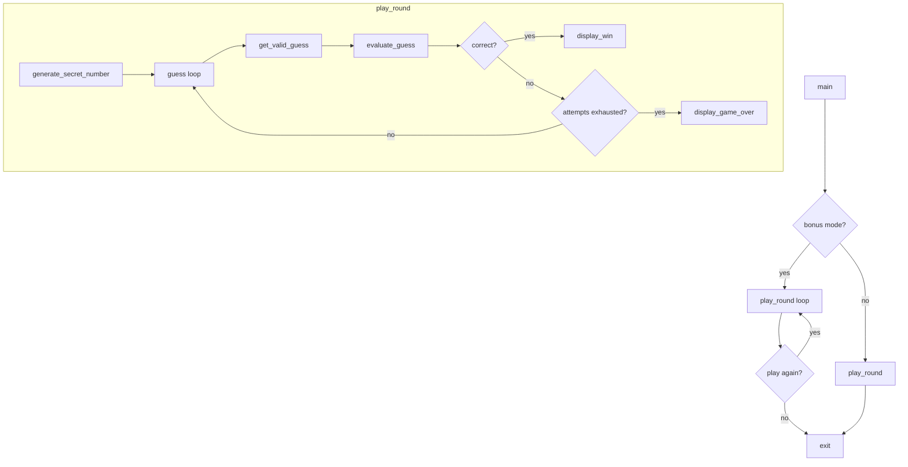

# Design Document: Number Guessing Game

## Overview

A Python command-line number guessing game implemented as a single-file script. The player tries to guess a randomly generated integer within a fixed number of attempts, receiving directional feedback after each valid guess. The design covers the base game (Requirements 1–6) and an optional bonus mode (Requirements 7–8) that adds increasing difficulty and replay capability.

The implementation targets Python 3.8+ with no external dependencies beyond the standard library (`random`, `sys`). The code is structured around three clearly separated concerns:

- **Number generation** — producing the Secret_Number for each Round
- **Input handling** — reading and validating player input
- **Feedback display** — printing messages to the player

This separation keeps each concern testable in isolation and makes the bonus mode easy to layer on top of the base game.

---

## Architecture

The game is a single Python module (`game.py`) with a thin `main()` entry point that wires together the three components. Control flow is straightforward: a `play_round()` function encapsulates one complete Round, and `main()` calls it once (base mode) or in a loop (bonus mode).



### Module layout

```
game.py
├── generate_secret_number(lower: int, upper: int) -> int
├── get_valid_guess(prompt: str) -> int          # loops until valid int
├── evaluate_guess(guess: int, secret: int) -> str   # "Too high" | "Too low" | "Correct"
├── display_win(attempts_used: int) -> None
├── display_game_over(secret: int) -> None
├── play_round(lower: int, upper: int, attempt_limit: int) -> bool   # True = win
├── ask_play_again() -> bool                     # bonus mode only
└── main() -> None
```

---

## Components and Interfaces

### `generate_secret_number(lower: int, upper: int) -> int`

Uses `random.randint(lower, upper)` to produce a uniformly distributed integer in the inclusive range `[lower, upper]`. Each call is independent — no shared state between rounds.

### `get_valid_guess(prompt: str) -> int`

Prints `prompt`, reads a line from stdin, and attempts `int()` conversion. On `ValueError` it prints an error message and loops, leaving the caller's attempt counter unchanged. Returns only when a valid integer is obtained.

### `evaluate_guess(guess: int, secret: int) -> str`

Pure function. Returns:
- `"Too high"` when `guess > secret`
- `"Too low"` when `guess < secret`
- `"Correct"` when `guess == secret`

### `display_win(attempts_used: int) -> None`

Prints a congratulatory message that includes `attempts_used`.

### `display_game_over(secret: int) -> None`

Prints `"Game Over"` and reveals `secret`.

### `play_round(lower: int, upper: int, attempt_limit: int) -> bool`

Orchestrates one Round:
1. Calls `generate_secret_number(lower, upper)`.
2. Loops up to `attempt_limit` times, calling `get_valid_guess` and `evaluate_guess`.
3. On a correct guess calls `display_win` and returns `True`.
4. On exhaustion calls `display_game_over` and returns `False`.

### `ask_play_again() -> bool`

Prompts the player with a yes/no question. Accepts `"y"` / `"yes"` (case-insensitive) as `True`, `"n"` / `"no"` as `False`. Re-prompts on any other input.

### `main() -> None`

Entry point. Detects bonus mode (e.g., via a `--bonus` CLI flag or a compile-time constant), then:
- **Base mode**: calls `play_round(1, 100, 7)` once.
- **Bonus mode**: starts with `lower=1, upper=100`; after each round increments `upper` by 50 and calls `ask_play_again()`.

---

## Data Models

The game is stateless between function calls — all state is passed as arguments or held in local variables. No classes or persistent storage are required.

| Name | Type | Description |
|---|---|---|
| `lower` | `int` | Inclusive lower bound of the current Range |
| `upper` | `int` | Inclusive upper bound of the current Range |
| `secret` | `int` | The Secret_Number for the current Round |
| `attempt_limit` | `int` | Maximum valid Attempts per Round (7) |
| `attempts_used` | `int` | Count of valid Attempts submitted so far |
| `guess` | `int` | The player's most recent valid Attempt |
| `feedback` | `str` | One of `"Too high"`, `"Too low"`, `"Correct"` |

---

## Correctness Properties

*A property is a characteristic or behavior that should hold true across all valid executions of a system — essentially, a formal statement about what the system should do. Properties serve as the bridge between human-readable specifications and machine-verifiable correctness guarantees.*

### Property 1: Secret number is always within range

*For any* valid range `[lower, upper]` where `lower <= upper`, the value returned by `generate_secret_number(lower, upper)` SHALL satisfy `lower <= result <= upper`.

**Validates: Requirements 1.1, 1.2**

---

### Property 2: evaluate_guess feedback is consistent with ordering

*For any* integers `guess` and `secret`, `evaluate_guess(guess, secret)` SHALL return `"Too high"` if and only if `guess > secret`, `"Too low"` if and only if `guess < secret`, and `"Correct"` if and only if `guess == secret`. This single property subsumes all three directional feedback criteria.

**Validates: Requirements 3.1, 3.2, 3.3**

---

### Property 3: Invalid input does not advance attempts

*For any* sequence of one or more strings that cannot be parsed as integers, followed by one valid integer string, `get_valid_guess` SHALL return the valid integer and the caller's `attempts_used` counter SHALL remain unchanged throughout all invalid inputs — only incrementing (if at all) after the valid integer is returned.

**Validates: Requirements 6.1, 6.2, 6.3**

---

### Property 4: Win message contains attempts used

*For any* positive integer `n` in `[1, 7]`, the output of `display_win(n)` SHALL contain the decimal representation of `n`.

**Validates: Requirements 4.1**

---

### Property 5: Game over message contains secret and "Game Over"

*For any* integer `secret`, the output of `display_game_over(secret)` SHALL contain both the literal string `"Game Over"` and the decimal representation of `secret`.

**Validates: Requirements 5.1, 5.2**

---

### Property 6: Range expands by exactly 50 each bonus round

*For any* sequence of `k` bonus rounds (k ≥ 2), the upper bound used in Round `k` SHALL equal the upper bound used in Round 1 plus `(k - 1) * 50`.

**Validates: Requirements 7.1**

---

### Property 7: Bonus round displays current range

*For any* valid range `[lower, upper]`, the output printed at the start of a bonus round SHALL contain both the decimal representation of `lower` and the decimal representation of `upper`.

**Validates: Requirements 7.2**

---

### Property 8: ask_play_again re-prompts on unrecognised input

*For any* non-empty sequence of strings that are not `"y"`, `"yes"`, `"n"`, or `"no"` (case-insensitive), followed by one valid response, `ask_play_again` SHALL re-prompt for each unrecognised input and only return after receiving the valid response.

**Validates: Requirements 8.4**

---

## Error Handling

| Scenario | Handling |
|---|---|
| Non-integer input | `get_valid_guess` catches `ValueError`, prints an error message, and re-prompts. `attempts_used` is not incremented. |
| Unrecognised play-again response | `ask_play_again` re-prompts until `"y"`, `"yes"`, `"n"`, or `"no"` is entered. |
| EOF / `KeyboardInterrupt` | Allow Python's default behaviour (print traceback or exit silently). No special handling required for a CLI learning exercise. |

---

## Testing Strategy

### Approach

The game's pure functions (`generate_secret_number`, `evaluate_guess`, `display_win`, `display_game_over`) are well-suited to property-based testing because their correctness is universal across all valid inputs. The I/O functions (`get_valid_guess`, `ask_play_again`, `play_round`, `main`) are tested with example-based unit tests using `unittest.mock` to patch `input()` and capture `print()` output.

**Property-based testing library**: [Hypothesis](https://hypothesis.readthedocs.io/) (Python)

Each property test is configured to run a minimum of 100 iterations via Hypothesis's `@settings(max_examples=100)` decorator.

### Property-Based Tests

Each test is tagged with a comment in the format:
`# Feature: number-guessing-game, Property <N>: <property_text>`

| Test | Property | Hypothesis strategy |
|---|---|---|
| `test_secret_in_range` | Property 1 | `st.integers()` pairs where `lower <= upper` |
| `test_evaluate_guess_feedback` | Property 2 | `st.integers()` for both `guess` and `secret` |
| `test_invalid_input_no_attempt_increment` | Property 3 | `st.lists(st.text(min_size=1))` of non-integer strings + one valid integer |
| `test_win_message_contains_attempts` | Property 4 | `st.integers(min_value=1, max_value=7)` |
| `test_game_over_message_contains_secret` | Property 5 | `st.integers()` |
| `test_bonus_range_expansion` | Property 6 | `st.integers(min_value=2, max_value=20)` for round count |
| `test_bonus_round_displays_range` | Property 7 | `st.integers()` pairs where `lower <= upper` |
| `test_ask_play_again_reprompts` | Property 8 | `st.lists(st.text())` of non-y/n strings + one valid response |

### Example-Based Unit Tests

- `play_round` wins on first guess (mock `input` returns secret immediately)
- `play_round` loses after 7 failed guesses
- `play_round` handles a mix of invalid then valid inputs
- `ask_play_again` returns `True` for `"y"` and `"yes"` (case-insensitive)
- `ask_play_again` returns `False` for `"n"` and `"no"`
- `ask_play_again` re-prompts on unrecognised input before accepting a valid response
- `main` in bonus mode increments upper bound between rounds
- `main` in bonus mode exits cleanly when player declines to play again

### Test File

All tests live in `test_game.py` alongside `game.py`. Run with:

```bash
python -m pytest test_game.py
```
